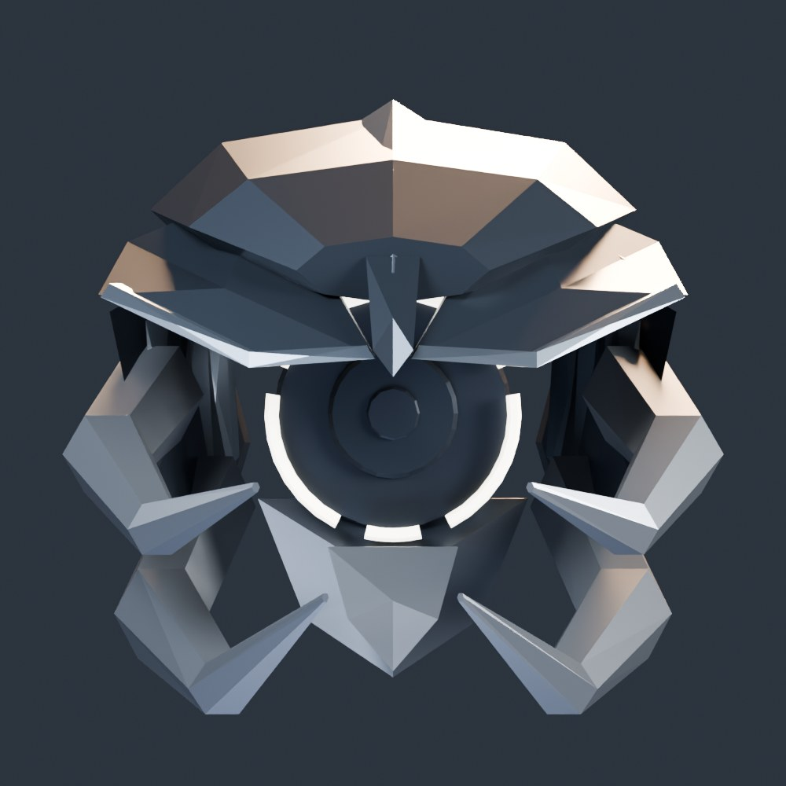
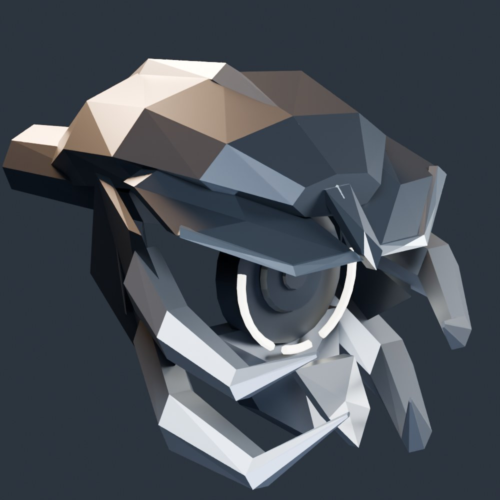

# Leaper V1.7 — alien predator face

For the centered, animated version, apply the [V1.8 motion patch](Leaper_V18_Centered_Motion.md)
after this pass. Existing V1.7 scenes can run V1.8 directly.

The head now has an elongated armored cranium, swept brow blades, temple gills,
four hooked mandibles and a pointed lower keel. The circular sensor remains the
focal point inside the skull. This is an original machine-creature design.

These are renders of the actual generated head on a test rig, without the body:





## Apply to your current Blender file

1. Download/pull the latest repository and open `Leaper_Standard_Final.blend`.
2. Switch to **Object Mode**. In **Scripting → Text → Open**, open
   `Tools/Blender/afterfall_leaper_v17_alien_predator_face.py`.
3. Press **Run Script**. You can run it directly over the V1.6F scene in the screenshot.
4. Inspect from the front and three-quarter views in Material Preview. Use **Save As**
   to save the revised scene before exporting.

Do not rerun V1.3 or older face passes afterward: they can reintroduce old parts or
rebuild cover bones. A final rig with `head`, `weak_eye` and `cover_eye` is required;
the script reports a missing prerequisite before changing the model.

The repository contains procedural source, not your local `.blend` or Unreal
skeletal mesh. Pulling the repository alone will not change an already-open model;
run this pass, then re-export/reimport the skeletal mesh.

## What is preserved

- Body, legs, their armor, animations, current frame and armature rest transforms.
- The existing circular sensor size convention and scanning-white material slot.
- `weak_eye`, `cover_eye`, `LEAP_WP_Eye_Grey` and the `LeaperSensorPlate` loot mapping.
- State colors: scanning white, alert yellow, attacking red.
- Dormant grey → discovered pale yellow → hit flash → breakable armor behavior.

The four mandibles and lower keel are rigidly weighted to `cover_eye`. The skull,
sensor and state ring are weighted to `head`, so breaking armor leaves the sensor
intact. No changes to the C++ damage/AI/loot logic are needed.

## Cleanup and repeated runs

V1.6F hid older face-pass objects but left the original rigid head housing/brow.
V1.7 also retires those parts by their final-rig binding or legacy face names,
scoped to this Leaper. This removes the visible round dome/flat box combination.
Old meshes are hidden and marked `V17_SupersededFace`; their previous visibility
is recorded on `V17_PreviousVisibility`. They remain available in the Outliner.

A joined mesh with both head and body weights is not automatically replaced.
Keep the final model's head as separate rigid parts for this pass. Re-running V1.7
replaces its own geometry and mesh data, without adding duplicate face layers.

The geometry is built in armature rest coordinates and the previous pose display
is restored afterward. An active crouch action is not baked into a second offset.

## Export to Unreal

1. Select `ARM_Leaper_Final` and the **visible current Leaper meshes**, including
   the new `LEAPER_V17_AlienFace` collection and the existing body/legs.
2. Export FBX with **Selected Objects** and Mesh + Armature. Exclude cameras,
   lights, reference characters and the hidden superseded faces.
3. Disable **Add Leaf Bones** and **Bake Animation** for the skeletal mesh export.
4. Export/reimport `SK_Leaper_Standard.fbx` into `Enemies/Leaper/Standard`, using
   the existing skeleton. Preserve the material slot names listed above.
5. In the enemy Blueprint, check scan/alert/attack colors and Eye armor break.

Four tiny material carriers are enclosed inside the opaque cranial shell. Keep
them selected for export: they carry alert, attack, discovered and hit materials
for the runtime's material discovery, without relying on hidden-object export.

## Validation

Run the Blender regression fixture from the repository root:

```sh
blender --background --factory-startup --python Tools/Blender/tests/test_leaper_v17_face.py
```

It checks original-head cleanup, repeat-run stability, closed nondegenerate
geometry, rest-space skinning on a transformed animated rig, preserved body/leg
meshes, missing-bone preflight, separate sensor/armor behavior, an upgrade from
the real V1.6F script, and an FBX export/import round trip with the required bones
and material slots. All four tests passed in Blender 5.2.2 LTS. The generated
face adds 1,218 triangles across 30 rigid mesh parts, including material carriers
and the neck bridge. The fixture is synthetic; the artist-local final `.blend`
and Unreal project assets still need their normal visual/import check.
