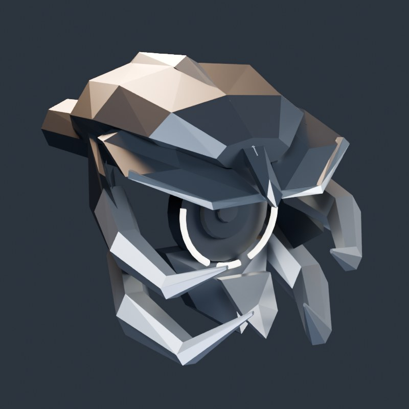
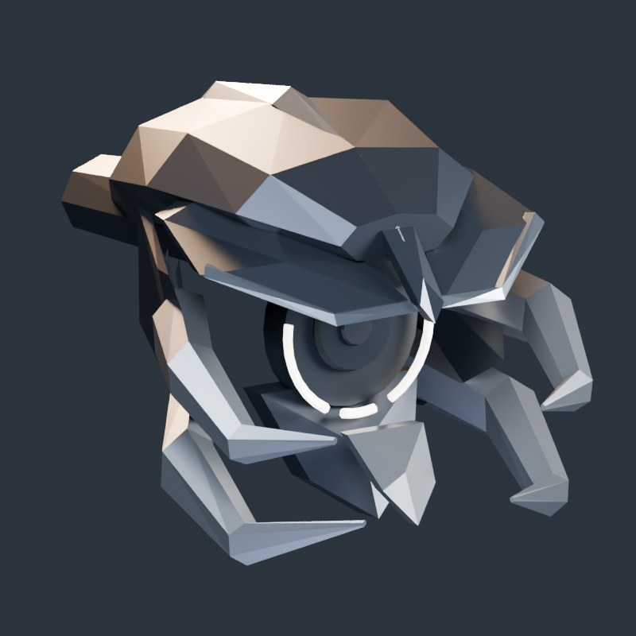

# Leaper V1.8 — centered face and moving mandibles

Apply this patch directly to the V1.7 model already open in Blender:

`Tools/Blender/afterfall_leaper_v18_centered_mandible_motion.py`

The file is standalone. It uses the V1.7 geometry already in the scene and does
not require importing another Python file.

## Run and preview

1. Open your existing Leaper `.blend` with the V1.7 face applied.
2. Switch to **Object Mode**.
3. In **Scripting → Text → Open**, select the V1.8 script and click **Run Script**.
4. Put the mouse over the **3D Viewport** and press **Space**.
5. Use **Save As** to keep the updated rig and animation.

The four-second loop flexes the upper/lower mandibles, opens them into a wider
threat pose, then returns to neutral. The sensor/head makes a small scanning
movement. The loop is placed on its own **Leaper V1.8 — Face Motion** NLA track.
Mute that track to pause the added animation independently of body/leg actions.
The script enables Pose Position and sets the timeline preview range for playback.

## Centering and fit

- The neutral face is projected onto the body centerline using paired leg roots.
- The old eye's sideways offset no longer determines the face direction.
- A separate aim bone compensates the existing frame-1 head pose, so an old
  sideways translation or local-axis roll does not tilt the neutral face away
  from the body's stance. Subsequent changes in the original head action remain.
- The face is lifted by 0.10 radius and tucked back by 0.06 radius for a closer fit.
- Hit/cover anchors follow the centered sensor and its scanning motion.

The approved V1.7 shape is retained. Original source mesh coordinates are stored
as mesh datablocks in the `.blend`, so a repeated run does not accumulate position
changes or duplicate hinge bones, animation tracks or source meshes.

The body/leg geometry and their existing action data are not rebuilt. No walking
or pounce animation is generated by this facial-motion patch.

## Rig and Unreal

The added control bones are:

| Bone | Parent | Purpose |
| --- | --- | --- |
| `face_aim_v18` | `head` | Neutral alignment and subtle head/sensor scanning |
| `cover_eye_mandible_upper_L` | `cover_eye` | Left upper mandible |
| `cover_eye_mandible_upper_R` | `cover_eye` | Right upper mandible |
| `cover_eye_mandible_lower_L` | `cover_eye` | Left lower mandible |
| `cover_eye_mandible_lower_R` | `cover_eye` | Right lower mandible |

Existing `weak_eye` and `cover_eye` anchors are recentered and reparented to
`face_aim_v18`. Breaking/hiding `cover_eye` still removes all mandibles and the
lower keel while leaving the skull and sensor intact. The new mandible names
start with `cover_eye`, which the existing C++ bone-prefix weak-point lookup
already recognizes. Existing material slots are preserved.

Re-export the skeletal mesh to include the added bones and updated eye anchors;
an old FBX cannot gain these controls from the animation alone. Reimport/update
the Unreal skeleton and check its reference pose and physics asset.

For a facial-animation export, select the rig plus current visible meshes, then:

1. Temporarily choose `Leaper_V18_FaceMotion` as the active action in the Action Editor.
2. Mute its NLA track during this export so the same animation is not evaluated twice.
3. Export FBX with **Bake Animation** on, **All Actions** off, **NLA Strips** off,
   and **Add Leaf Bones** off, using the action's four-second frame range.
4. Restore the prior active action and unmute the face NLA track for Blender preview.
5. In Unreal, use the face clip on a branch beginning at `face_aim_v18` so the
   existing body/leg animation remains responsible for locomotion.

The Blender script does not automatically modify an already imported Unreal mesh
or wire a clip into its Animation Blueprint.

## Preview and validation

Native Blender renders of the generated head on a test rig:





```sh
blender --background --factory-startup --python Tools/Blender/tests/test_leaper_v18_motion.py
```

Four checks pass in Blender 5.2.2 LTS: centering and body/action preservation on a
transformed rig, stable repeat runs, mirrored motion/loop closure/armor break,
missing-face preflight, and an animated FBX export/import round trip. These tests
use a synthetic final rig; the artist's local `.blend` is not in the repository.
